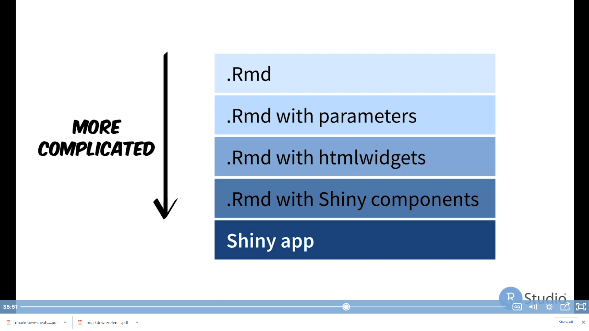

```{r setup, include=FALSE}
knitr::opts_chunk$set(echo = TRUE, 
                      message = FALSE, 
                      warning = FALSE, 
                      dpi = 300)
library(knitr)# Ovdje sta podesis u zagradi to ce se odnositi na sve chankove. Probaj to sa mjenjanejm ovdje ovog scho na tru ili false.
```

## R Markdown

Pokusaj kreiranja nabrajanja: 

* prvo
* drugo

This is an R Markdown document. Markdown is a simple formatting syntax for authoring HTML, PDF, and MS Word documents. For more details on using R Markdown see <http://rmarkdown.rstudio.com>. U sta se sve može konvertovati R Markdown dokument dato je u ovom kratkom videu <https://vimeo.com/178485416>.

When you click the **Knit** button a document will be generated that includes both content as well as the output of any embedded R code chunks within the document. You can embed an R code chunk like this:

```{r cars}
summary(cars)
```

### Tables

A možeš tabelu i da prikažeš kroz *kable* paket i djeluje više fensi:
```{r kable cars}
kable(summary(cars), caption="Tabela sa kable funkcijom.")
```

Vise o tabelama možeš pronaci [link](https://rmarkdown.rstudio.com/lesson-7.html).

Zanimljiv je izgled tabele koji se dobija sa paketom *xtable* i *stargazer*. Ispod je prmjer sa *stargazer* paketom.

```{r, results='asis'}
stargazer::stargazer(summary(cars), type = "html", title = "Tabela sa stargazerom")
```


A isto tako možeš i kroz *html* vidžet da djeluje još više interaktivna:

```{r}
library(DT)
datatable(iris, options = list(pageLength = 5))
```

Na ovom linku mozes pronaci vise o tim tabelama <https://gallery.htmlwidgets.org/>.

U domacem zadati tabelu koju moraju filtrirati i pronaci neke vrijednosti i ubaciti ih u tabelu.


***Dodati kasnije jos koji zanimljiv vidget kod slika**

## Including Plots

You can also embed plots, for example:

```{r pressure, echo=FALSE}
plot(pressure)
```

Note that the `echo = FALSE` parameter was added to the code chunk to prevent printing of the R code that generated the plot.

Ako hoces ovaj dokument da pretvoriš u knjigu, samo gore u output stavi `output: bookdown::gitbook: default`. Dokument se pretvara u u knjigu.

### Slike detalji

Sto se tice slika mogu se ukljuciti na dva načina . Više detalja o svemu ovom pogledaj kada te bude interovalo.

```{r, out.width="60%", out.height="60%", fig.align='center', fig.cap="Isporobavanje mogucnosti slike"}
 
```

## References and equations

* Primjer citiranja (@Rforecast) i jednačine $E=mc^2$. Kada se stave dva dolara onda jednacina ide u novi red sama za sebe $$E=mc^2$$

### References