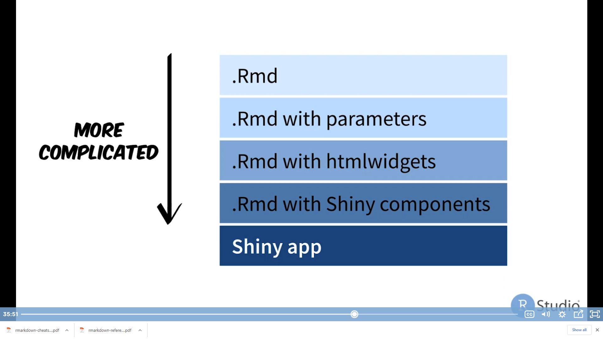
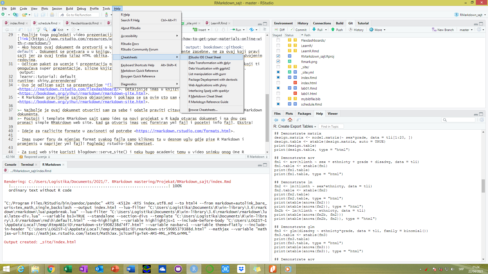

```{r setup, include=FALSE}
knitr::opts_chunk$set(echo = FALSE)
```

## Raspored ucenja

Raspored ucenja je sledeci:

* Prvo Lab1 dokumnet prouciti i razlicite mogucnosti za uređivanje u RMarkdown dokumentima
* [Dobro upustvo](https://rmarkdown.rstudio.com/lesson-5.html)
* Nakon toga mozda pogeldati onaj dugacki film o mogucnostima RMarkdowna, a kasnije i one video snimke o reproducibility and R in procudtion gdje se objasnjava nivo interakcije koji je moguce ostvatiri sa raličitim stepenima (_parametrizacija izvjestaja, dodavanje html widgeta <https://www.htmlwidgets.org/>, <https://www.htmlwidgets.org/showcase_datatables.html>, shiny..._) 

```{r, out.width="60%", out.height="60%", fig.align='center', fig.cap="Isporobavanje mogucnosti slike"}
 
```

* Pogeldaj takođe i izuci različite sheat sheetove, knjigu koju imas kuci, mastering R studio, kao i knjigu koja je napisana samo o RMarkdownu. Napraviti svoj template u R-u da imas za radove i prezentacije.
* [R Markdown: The Definitive Guide](https://bookdown.org/yihui/rmarkdown/) Ovo zaista trebas da pročitas jer je sveobuhvatno.
* Pogledaj i one video tutorijale koje si poceo kuci da gledas a ticu se Scinetiic writhing in R <https://www.youtube.com/watch?v=L_ShS68jouA>.
- Nakon toga pogledati iskustva prof. Hidmana sa korišćenjem RMarkdowna [link](https://www.youtube.com/watch?v=_D-ux3MqGug),
- Poslije toga pogledati video prezentaciju pravljenja sajtva [link](https://www.rstudio.com/resources/webinars/sharing-on-short-notice-how-to-get-your-materials-online-with-r-markdown/)
- Ako hoces ovaj dokument da pretvoriš u knjigu, samo gore u output stavi `output: bookdown::gitbook: default`. Dokument se pretvara u u knjigu, ali to vazi za RMarkdown dokumente zasebne, ne za ovaj koji pravi sajt jer za ovaj treba izlaz HTML oblika. Takođe mislim da output i ovaj nastavak trebaju da budu u odvojenim redovima.
- Odlican paket za ucenje i prezentaciju materijala je `learnr` <https://rstudio.github.io/learnr/>, koji ti omogućava super prezentacije, slicne knjizi <https://blog.rstudio.com/2017/07/11/introducing-learnr/>. `output: 
 learnr::tutorial: default
runtime: shiny_prerendered`
- Ovo je odlican sajt sa prezentacijom *flexdashboarda* formata koji je odličan za prezentaciju <https://rmarkdown.rstudio.com/flexdashboard/>. Detaljnije imas u knjizi <https://bookdown.org/yihui/rmarkdown/rmarkdown-site.html>.
- R Markdown pravljenje sajtova objasnjeno i poklapa se sa ovim sto sam ovdje radio <https://bookdown.org/yihui/rmarkdown/rmarkdown-site.html>.
- Ovdje je sve o knit paketu i chankovima receno <https://yihui.org/knitr/options/>.

>- Najbolje je ovaj dokumnet otvoriti sam za sebe i odatle praviti citavu strukturu, ne iz pocetnog RMarkdown dokumenta.
>- Postoji i template RMarkdown sajt samo ides na novi projekat u R kada otvaras dokumnet i na dnu ces pronaci simple RMakrdown web site. kad ga otvoris imas vec formiran yml fajl i pocetni info fajl. Ekstra!

- Ideje za razlicite formate u zavisnoti od potrebe <https://rmarkdown.rstudio.com/formats.html>.

- Imas super foru da mjenjas format svakog fajla samo kliknes tu u desnom uglu gdje pise R Markdown i promjenis u naprijer yml fajl! Pogledaj rstudio-ide cheetset.
- Imas odlicno mjesto za cheetsetove u samom R-u... 
- Netlify sajt je odlica za postavljanje, nauci malo o njemu i bavi se sa njim kasnije jer je super!

- Za svoj web site koristi blogdown::serve_site() i neku hugo academic temu u video snimku onog One R markdown document 14 demos imas na kraju dobro objasnjenje.

- **VAŽNO** Kada pravis sajt sve radi normalno međutim kada site folder uploadujes na GitHub traje jako dugo, cak ne stigne ni stage proces da se završi. Tako da procedura nek ti bude ti mjenjaj sve ovdje i staguj manje foldere ovdje a rucno ubacuj u github folder site fajl svaki pun kad generises bilo kakvu promjenu jer se mjenja citav folder koji ima 5 mb.
Kasnije kako budes ucio dodati jos koraka i medjufaza u [Raspored ucenja](#anchor)

# Reference